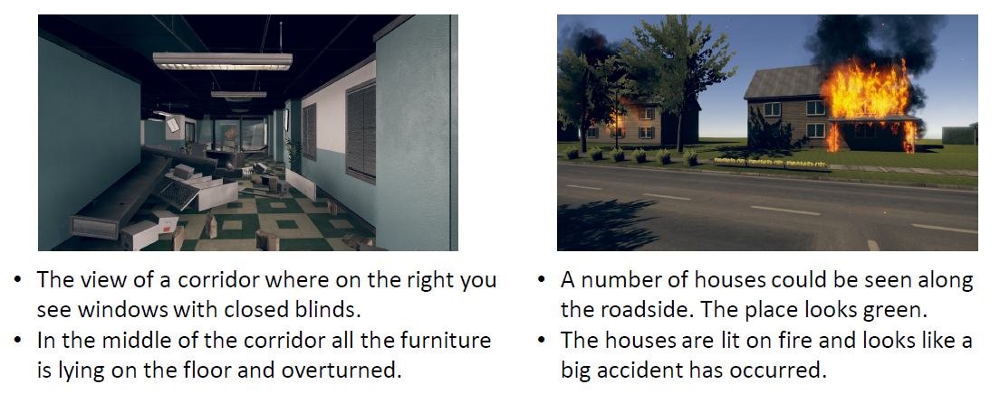

# DISC-L
Image-description dataset for multimodal scene perception. It consists of 1000 images taken from [DISC dataset](https://www.ri.cmu.edu/wp-content/uploads/2019/06/IROS19_DISC_final_v1.pdf)

If you use the dataset, please cite our paper:
```
@article{shree2021,
  title={Exploiting  Natural  Language  for  Efficient  Risk-AwareMulti-robot  SaR  Planning},
  author={Shree, Vikram, and Asfora, Beatriz, and Zheng, Rachel, and Hong, Samantha, and Banfi, Jacopo, and Campbell, Mark},
  journal={submitted to ICRA},
  year={2021}
}
```

## Samples
Here are a few samples taken from the dataset:



## Descriptors
The descriptors can be found [here](disc_caption_all.json) 
