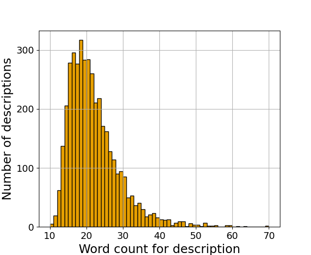
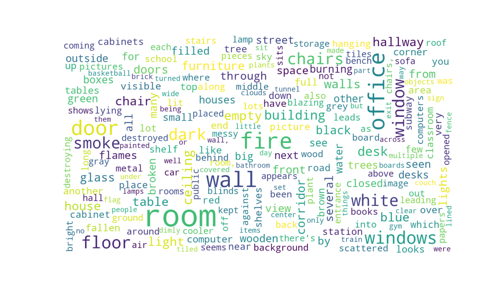

# DISC-L
Image-description dataset for multimodal scene perception. It consists of 1000 images taken from [DISC dataset](https://www.ri.cmu.edu/wp-content/uploads/2019/06/IROS19_DISC_final_v1.pdf)

If you use the dataset, please cite our paper:
```
@article{shree2021,
  title={Exploiting  Natural  Language  for  Efficient  Risk-AwareMulti-robot  SaR  Planning},
  author={Shree, Vikram, and Asfora, Beatriz, and Zheng, Rachel, and Hong, Samantha, and Banfi, Jacopo, and Campbell, Mark},
  journal={accepted for publication in R-AL},
  year={2021}
}
```

## Samples
Here are a few samples taken from the dataset:


Please refer to [SamplesData.pdf](SamplesData.pdf) for additional sample images and responses. We show both: accepted and rejected responses for each image.

## Images
The images used for the data collection can be found [here](https://drive.google.com/drive/folders/1aL-zvjFEbxcDd9AcXLpbf82pX30-b2gH?usp=sharing).

## Descriptions
The descriptions collected from the Amazon MechTurk study can be found in the file [disc_caption_all.json](disc_caption_all.json).

## Summary
DISC-L consists of descriptions of emergency situations from 720 unique AMT users. A histogram of word-counts can be seen below:



The wordcloud below shows the most frequently used words in the responses:




## Descriptors for danger estimation
We have used 5 set of descriptors for collapse and fire scene to assess the danger level, which are treated as descriptions provided by the "commander in chief". The descriptors can be found in [Appendices.docx](Appendices.docx).
